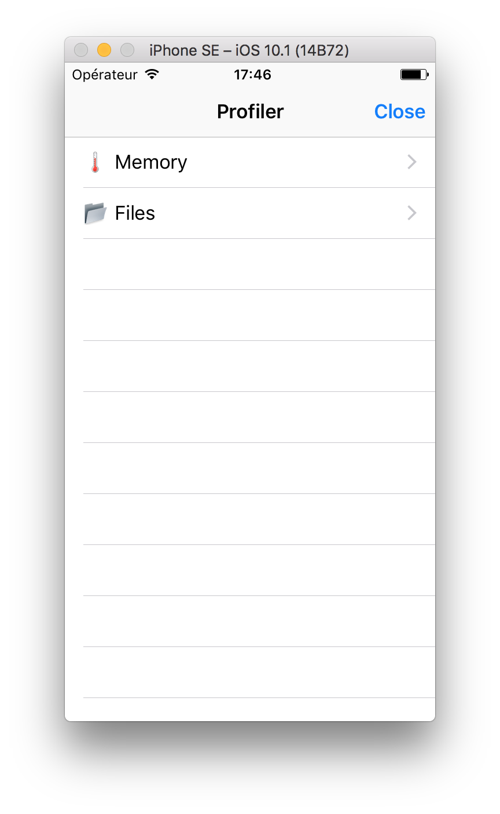
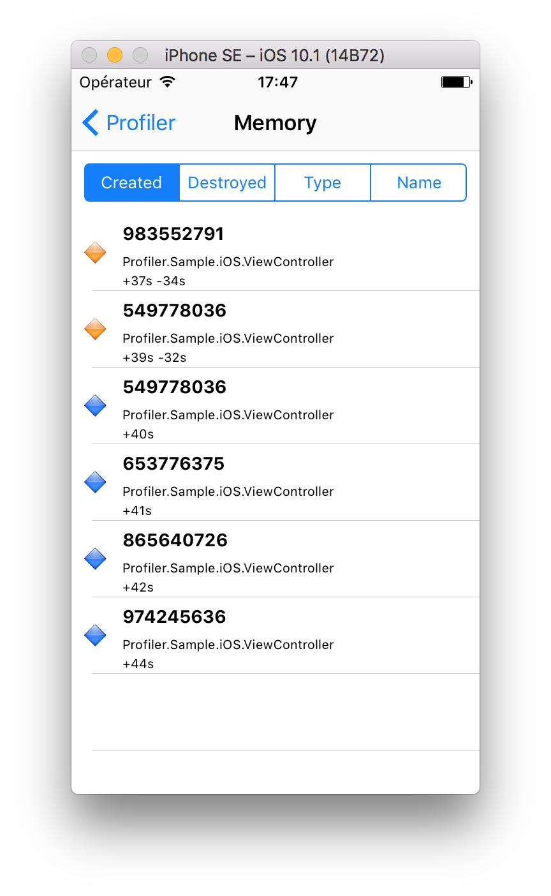
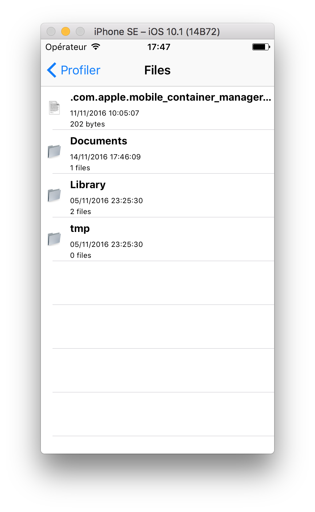
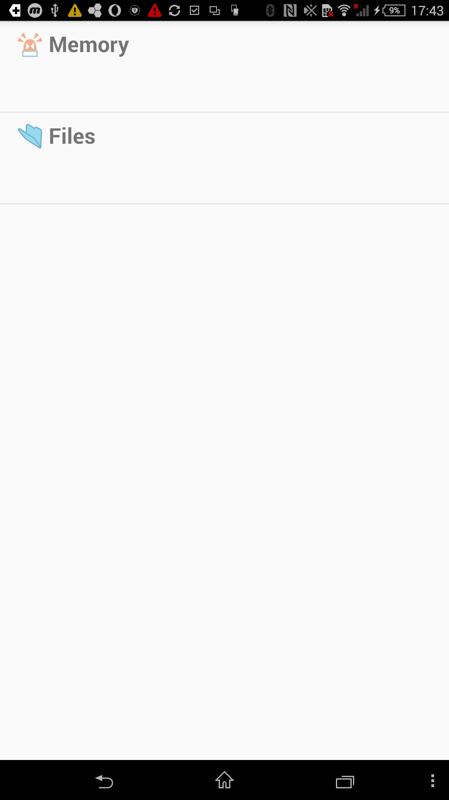
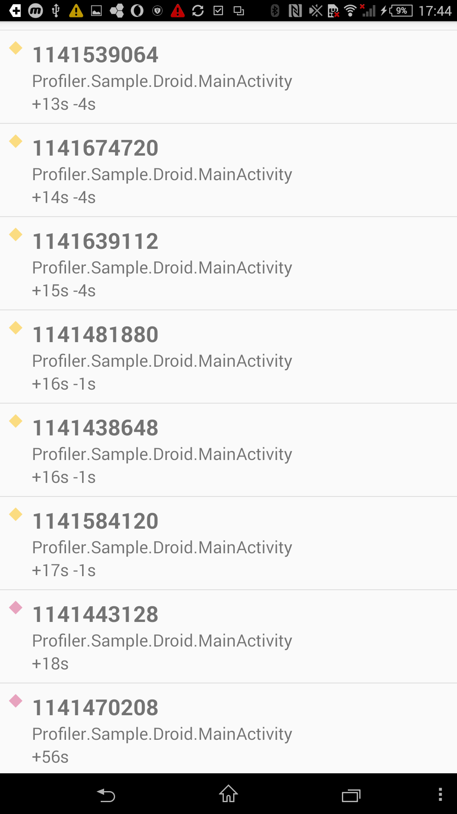
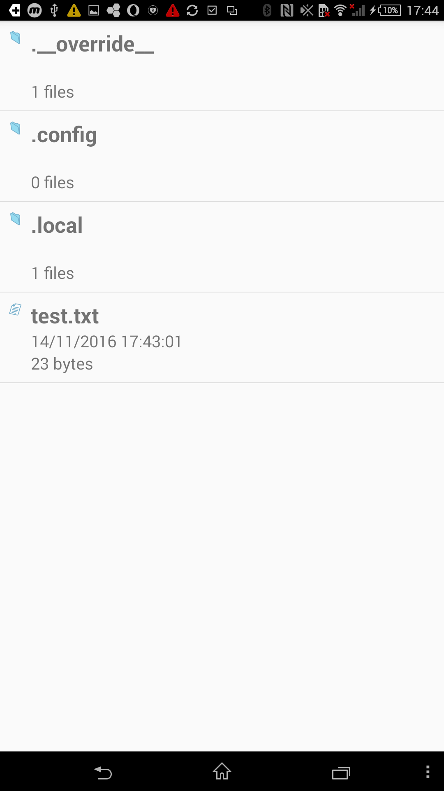

# Profiler

A *really* basic in-app profiler for Xamarin and UWP applications.

## Usage

### Memory

A memory profiler is available and will track a set of registered instances in a loop (*be careful, this process is heavy and don't activate this functionality in production*).

#### Instance registration

First, register any instance you want to profile

```csharp
public ViewController()
{
	Debugging.Profiler.Default.Memory.Register(this);
}
```

You can also define a unique key (by default its instance HashCode).

```csharp
public ViewController()
{
	Debugging.Profiler.Default.Memory.Register(this, "MyVC");
}
```

Finally, you can track and log properties on your profiled instances.

```csharp
public ViewController()
{
	Debugging.Profiler.Default.Memory.Register(this, nameof(Title));
}
```

### Start profiling

```csharp
Debugging.Profiler.Default.Start();
```

### View













To display the profiler view use the `Show` method.

```csharp
Debugging.Profiler.Default.Show();
```

A shake gesture is a common scenario for showing this view.

```csharp
// iOS : AppDelegate
UIApplication.SharedApplication.ApplicationSupportsShakeToEdit = true;

// iOS : Root view controller
public override void MotionEnded(UIEventSubtype motion, UIEvent evt)
{
	if (motion == UIEventSubtype.MotionShake)
	{
		Debugging.Profiler.Default.Show();
	}
}
```


```csharp
// Android : Activities
private ShakeListener shake;

protected override void OnResume()
{
	base.OnResume();

	shake = ShakeListener.Register(this);
	shake.Shaked += OnShaked;
}

protected override void OnPause()
{
	base.OnPause();

	shake.Unregister();
}

private void OnShaked(object sender, System.EventArgs e)
{
	shake.Shaked -= OnShaked;
	Debugging.Profiler.Default.Show(this);
}
```

## Roadmap

- [X] Profiling
- [X] iOS View
- [X] iOS Sample
- [ ] Android View (In-Progress)
- [X] Android Sample
- [ ] NuGet package

- [ ] Add filters to views
- [ ] Add graphs to views

## Contributions

Contributions are welcome! If you find a bug please report it and if you want a feature please report it.

If you want to contribute code please file an issue and create a branch off of the current dev branch and file a pull request.

### License

MIT © [Aloïs Deniel](http://aloisdeniel.github.io)