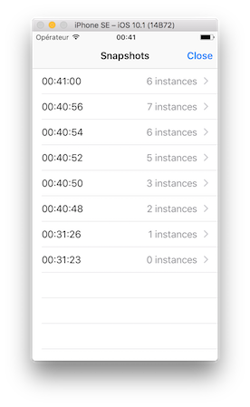

# Profiler

A *really* basic in-app profiler for Xamarin and UWP applications.

## Usage

### Instance registration

First, register any instance you want to profile

```csharp
public ViewController()
{
	Debugging.Profiler.Default.Register(this);
}
```

You can also define a unique key (by default its instance HashCode).

```csharp
public ViewController()
{
	Debugging.Profiler.Default.Register(this, "MyVC");
}
```

Finally, you can track and log properties on your profiled instances.

```csharp
public ViewController()
{
	Debugging.Profiler.Default.Register(this, nameof(Title));
}
```

### Start profiling

```csharp
Debugging.Profiler.Default.StartProfiling();
```

### View



To display the profiler view use the `Show` method.

```csharp
Debugging.Profiler.Default.Show();
```

A shake gesture is a common scenario for showing this view.

```csharp
// iOS : AppDelegate
UIApplication.SharedApplication.ApplicationSupportsShakeToEdit = true;

// iOS : Root view controller
public override void MotionEnded(UIEventSubtype motion, UIEvent evt)
{
	if (motion == UIEventSubtype.MotionShake)
	{
		Debugging.Profiler.Default.Show();
	}
}
```

## Roadmap

[X] Profiling
[X] iOS View
[X] iOS Sample
[ ] Android View
[ ] Android Sample
[ ] NuGet package

[ ] Add filters to views
[ ] Add graphs to views

## Contributions

Contributions are welcome! If you find a bug please report it and if you want a feature please report it.

If you want to contribute code please file an issue and create a branch off of the current dev branch and file a pull request.

### License

MIT © [Aloïs Deniel](http://aloisdeniel.github.io)